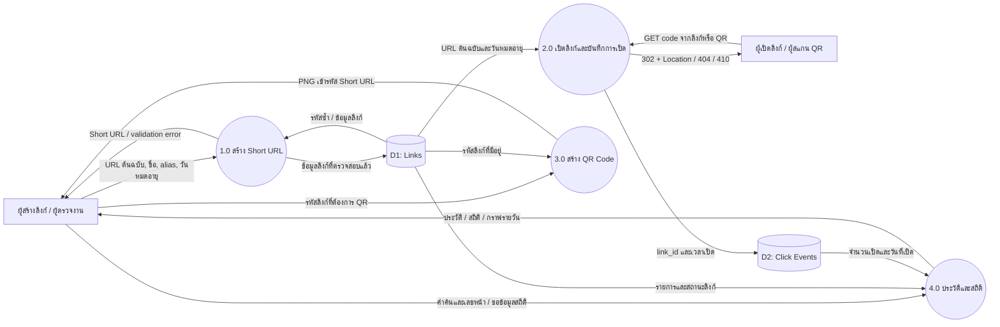
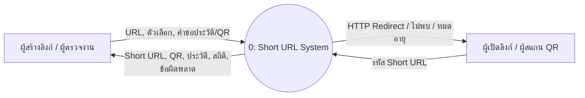
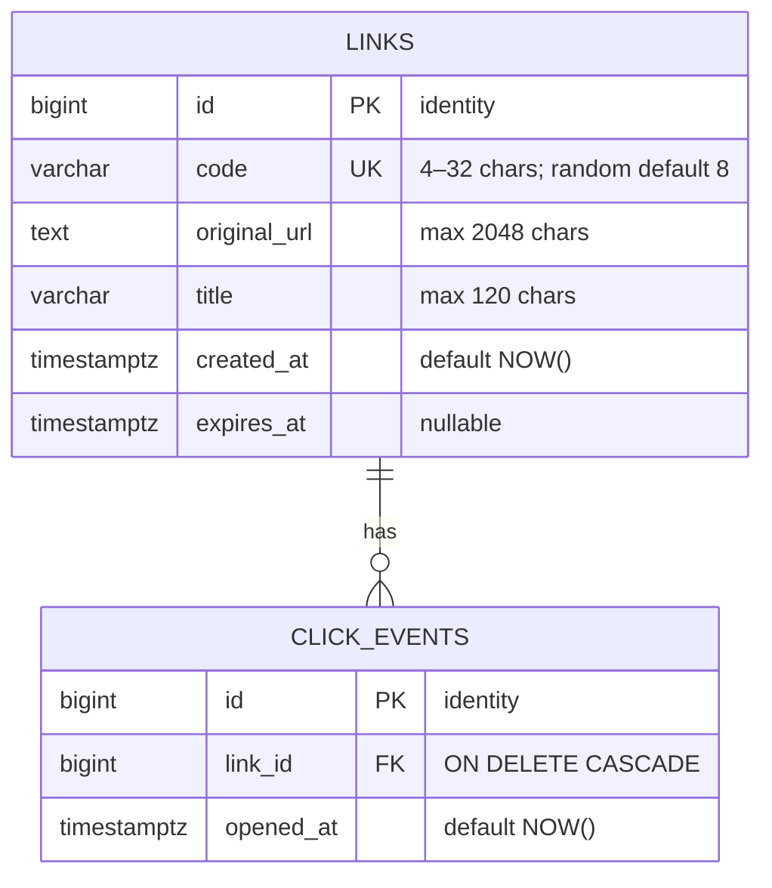
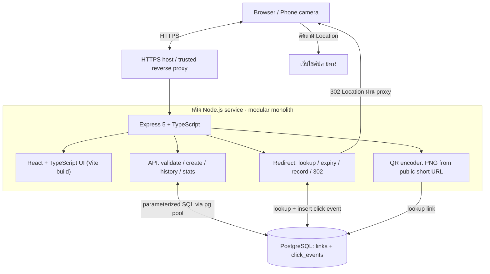
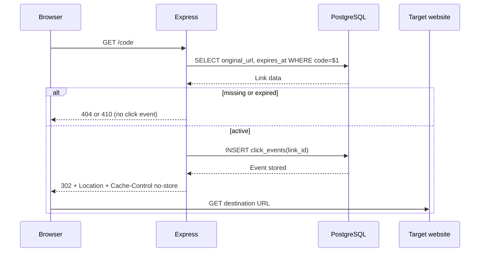

# System diagrams

แผนภาพตรงกับ implementation: shared workspace ไม่มี authentication, Backend หนึ่ง service พร้อมฐานข้อมูล PostgreSQL

## DFD Level 0

แสดง process หลัก ข้อมูลเข้าออก external entities และ data stores โดย QR preview ไม่สร้าง Click Event

บางตำราเรียก context diagram ว่า Level 0 และ decomposition ว่า Level 1 จึงแนบ context view ไว้เพิ่มเติมเพื่อให้ตรวจได้ทั้งสอง convention

## ER Diagram

หนึ่งลิงก์มี event ตั้งแต่ 0 ถึงหลายรายการ จำนวนเปิดคำนวณจาก COUNT ของ event ไม่มี IP/user-agent และไม่มี user table เพราะเป็น shared demo

Indexes: unique `links.code`, `links(created_at DESC, id DESC)`, `click_events(link_id)`, `click_events(opened_at)`

## Architecture Diagram

Backend ไม่ fetch เว็บไซต์ปลายทาง Browser เป็นผู้ตาม redirect ฐานข้อมูลเป็น persistent service แยกจากแอป Diagram นี้ไม่ใช่ microservice architecture

## Sequence: การเปิดลิงก์

