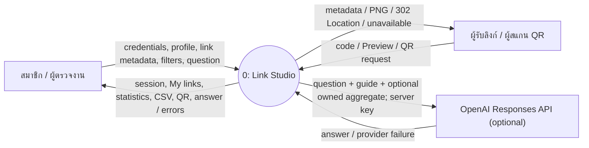
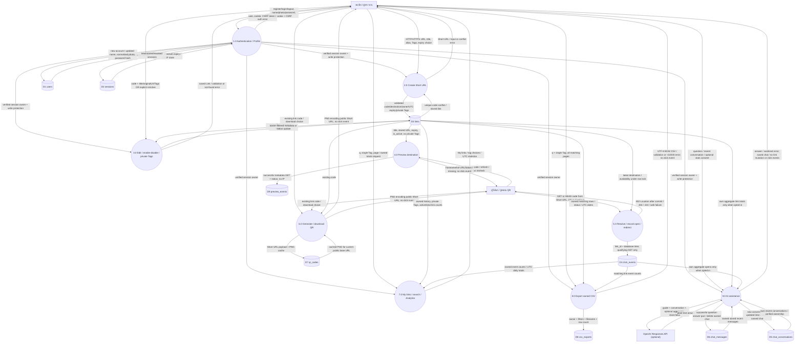
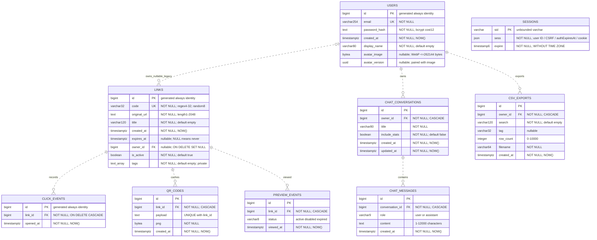
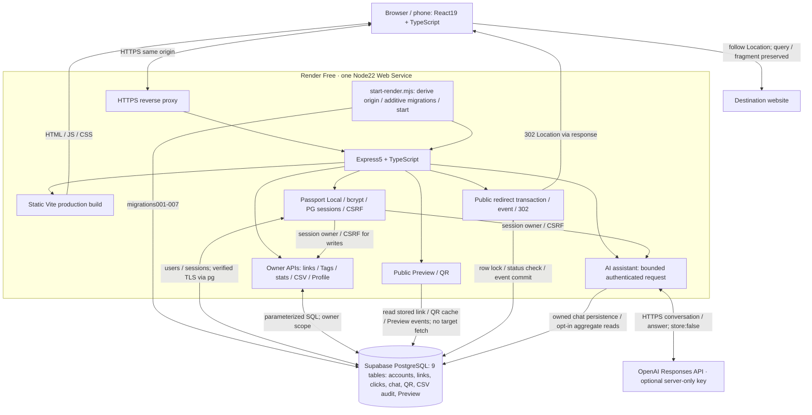
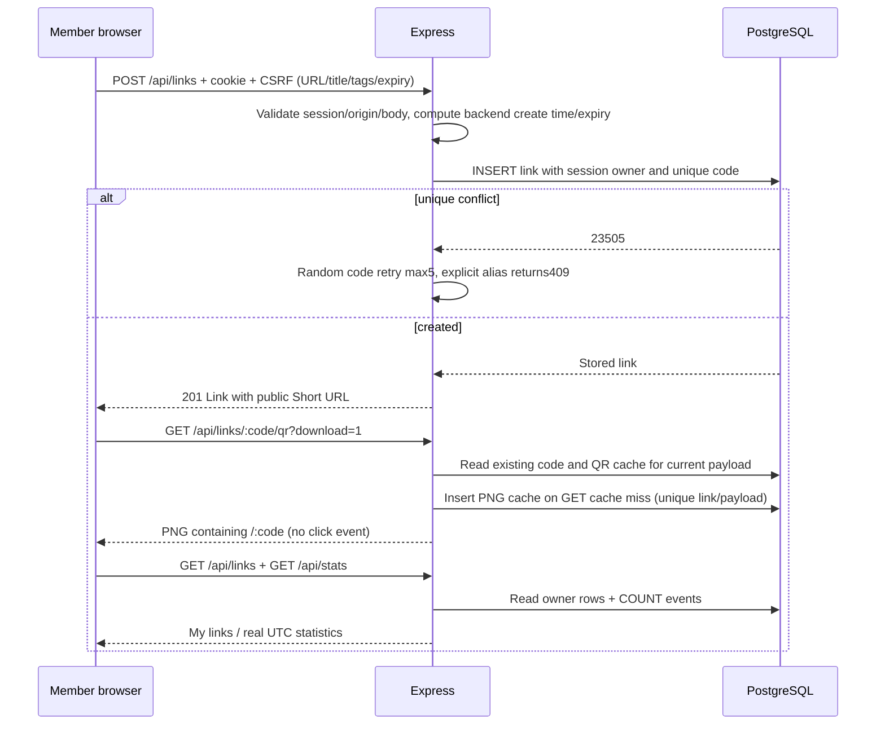
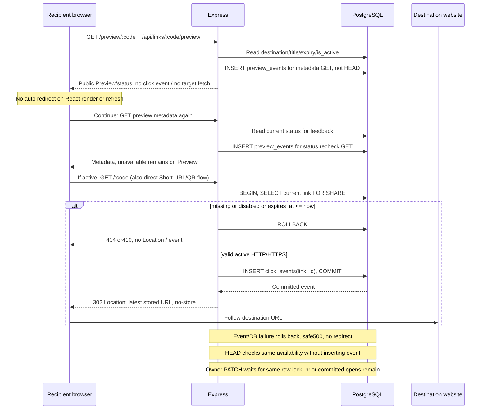
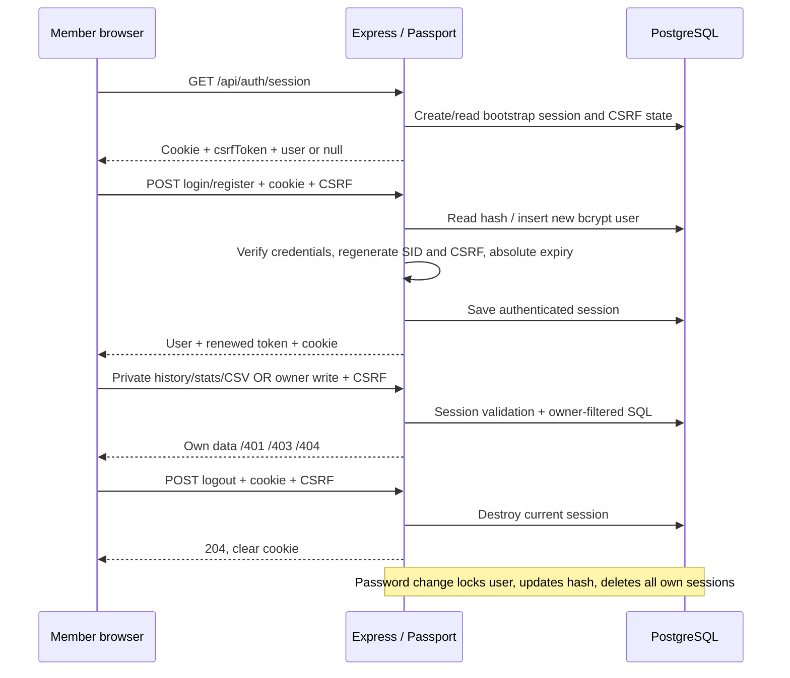

# Link Studio — System diagrams

ตรวจเทียบ source code และ migrations 001–007 เมื่อ 2026-10-04: [System design](SYSTEM.md), [API](API.md), [Data dictionary](DATABASE.md) ระบบมี 9 application tables รวม private chat, QR cache, CSV export audit และ Preview views; Tags อยู่ใน links

Mermaid ด้านล่างเปิดดูได้บน GitHub; source แยกอยู่ใน `docs/diagrams/*.mmd` สำหรับ export/นำเสนอ ทุก process เป็นฟังก์ชันภายใน service เดียว ไม่ใช่ microservice

ไฟล์ SVG สำหรับเปิดเต็มหน้าและ zoom: [Context](diagrams/context.svg), [DFD Level 0](diagrams/dfd-level-0.svg), [ER](diagrams/er.svg), [Architecture](diagrams/architecture.svg), [Create sequence](diagrams/create-sequence.svg), [Redirect sequence](diagrams/redirect-sequence.svg), [Auth sequence](diagrams/auth-sequence.svg). DFD รวมมีข้อมูลหลาย flow ควรเปิด SVG เต็มหน้าควบคู่ตาราง mapping; SVG เป็น snapshot ต้อง render ใหม่เมื่อแก้ Mermaid source

## Context diagram

แสดงขอบเขตทั้งระบบโดยไม่มี data store บางตำราเรียก context นี้ Level 0 จึงแนบคู่กับ DFD ที่แตก process หลักด้านล่าง

เว็บไซต์ปลายทางไม่ใช่ provider ที่ backend ส่ง request ไป ระบบส่ง Location ให้ browser แล้ว browser จึงติดต่อเว็บไซต์เอง

## DFD Level 0

แสดง external entities, numbered processes, data stores และ named data flows ครบฟังก์ชันหลักและฟีเจอร์ปัจจุบัน D1–D9 เป็นตารางใน PostgreSQL เดียวกัน ลูกศร store→process เป็นข้อมูลที่อ่าน และ process→store เป็นข้อมูลที่เขียน ไม่ใช่ลำดับเวลา

### Process → implementation mapping

| Process | Routes / files | Store effect |
|---|---|---|
| 1.0 | /api/auth/*; auth.ts / avatar.ts | users + sessions read/write; password change revokes all own sessions |
| 2.0 | POST /api/links; app.ts | INSERT links |
| 3.0 | PATCH /api/links/:code and /status; app.ts / tags.ts | UPDATE owned links only |
| 4.0 | /preview/:code and /api/links/:code/preview | read links only |
| 5.0 | GET/HEAD /:code | read links; successful GET INSERT click_events |
| 6.0 | GET /api/links/:code/qr | read links, generate PNG in memory |
| 7.0 | GET /api/links, /api/tags, /api/stats | owner-scoped reads; stats ignore q/tag filters |
| 8.0 | GET /api/links/export.csv; csv.ts | owner-scoped reads, no persisted export |
| 9.0 | /api/assistant/status and /chat; assistant.ts | optional aggregate reads, external API, owned chat_conversations/chat_messages |

Public processes 4–6 do not require Login. Private processes use identity from server session; no supplied owner_id can select another owner. Legacy ownerless links still work publicly. Redirect is the only business flow that writes click_events; session bootstrap may write sessions independently.

### DFD views สำหรับนำเสนอ

ใช้ process/data-flow เดียวกับ DFD รวม แยกภาพเพื่อลดเส้นไขว้ ไม่ใช่ processes ใหม่หรือ Level 1 decomposition; entity/store ที่ซ้ำหมายถึง entity/store เดียวกันในระบบ:

- [1.0–3.0 บัญชี / Profile / สร้างและจัดการลิงก์](diagrams/dfd-account-links.svg) · [Mermaid source](diagrams/dfd-account-links.mmd)
- [4.0–6.0 Preview / Redirect / QR สาธารณะ](diagrams/dfd-public-links.svg) · [Mermaid source](diagrams/dfd-public-links.mmd)
- [7.0–9.0 My links / Analytics / CSV / AI](diagrams/dfd-reports-ai.svg) · [Mermaid source](diagrams/dfd-reports-ai.mmd)

ภาพรายงานแสดงเฉพาะ business data flows; verified identity ของ 1.0 → 7.0/8.0/9.0 ดูในภาพรวมและ mapping ทุก private endpoint ยังต้อง Login ตาม API.md

## ER Diagram

ER type labels varchar254/varchar80/varchar120/varchar32/timestamp6/text_array หมายถึง PostgreSQL VARCHAR(254)/(80)/(120)/(32), TIMESTAMP(6) และ TEXT[] ตาม [Data Dictionary](DATABASE.md) ไม่ใช่ custom database types

หนึ่ง user มี0..N links; link มี0..1 owner; event ต้องมีหนึ่ง link Sessions แยกใน ER เพราะ user ID เก็บใน JSON ไม่มี foreign key จริงและมี anonymous sessions ได้ ไม่วาด FK ปลอม ไม่มี column short_url/clicks/status/hostname: คำนวณจาก config, COUNT(events), URL parser และสถานะล่าสุด

Indexes/constraints/nullability/migrations ทั้งหมดอยู่ใน DATABASE.md เวลา links/users/events ใช้ TIMESTAMPTZ; session expire เป็น TIMESTAMP(6) without time zone ของ connect-pg-simple ไม่มีตาราง Tags แยก ไม่มี Supabase auth.users/Storage buckets ใน implementation นี้

## Architecture Diagram

หนึ่ง modular monolith + persistent database แยก ไม่ใช่ microservices Production ใช้ origin เดียวจึงไม่ต้อง general CORS; browser ไม่เชื่อม DB โดยตรง Supabase ใช้เฉพาะ PostgreSQL Session pooler verified TLS ไม่ใช้ Supabase Auth/Data API/Storage รูปเก็บใน DB, QR/CSV สร้างเมื่อขอ ไม่เก็บไฟล์ใน Render disk

## Sequence: Create / QR / history

## Sequence: Preview / Redirect / events

Disabled precedence over Expired over Active; enable never clears expiry. Old QR/short code stays unchanged after edits/status updates but old PNG containing localhost requires downloading a fresh production QR. Query sent to Short URL cannot override stored destination.

## Sequence: Login / private APIs / Logout

## Verification boundary

Diagram ตรวจจาก source และ migrations ไม่ได้ยืนยัน production schema ทุก column ด้วย information_schema ไม่ใช่ผล penetration test Online build/migration/health/cookie flags/Login UI ตรวจแล้ว; authenticated live flows, phone QR scan และ CI run ยังต้องตรวจตาม TESTING.md / RENDER.md
