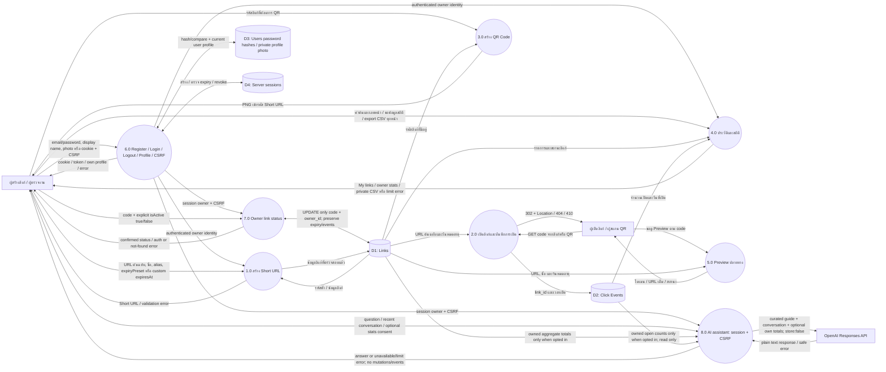
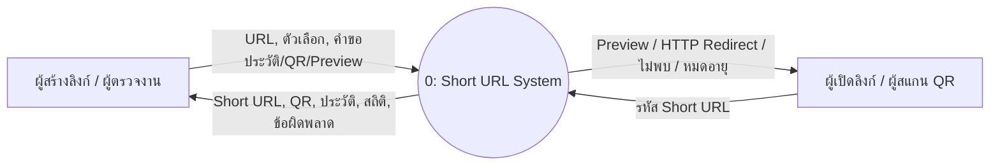
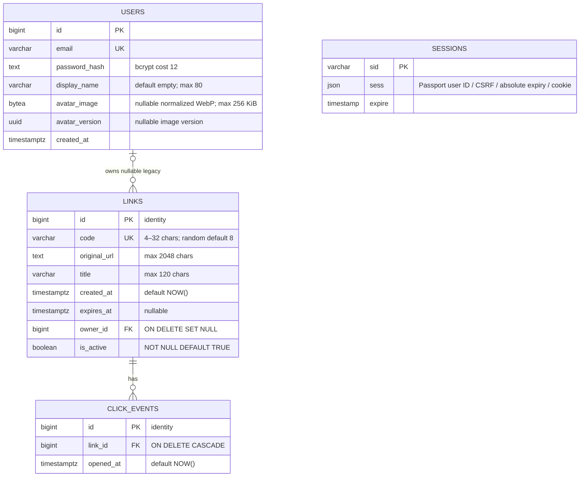
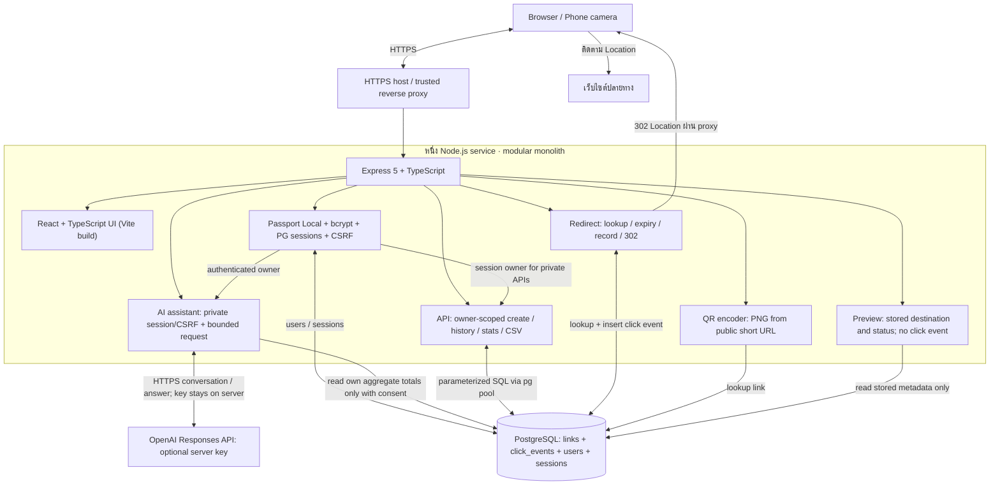
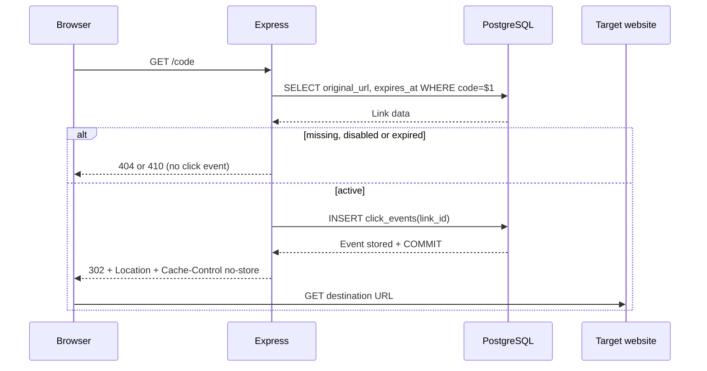

# System diagrams

แผนภาพตรงกับ implementation: Login/My links พร้อม ownership ที่ backend; Short URL/Preview/QR ยังสาธารณะ, Backend หนึ่ง service พร้อมฐานข้อมูล PostgreSQL

## DFD Level 0

แสดง process หลัก ข้อมูลเข้าออก external entities และ data stores โดยหน้า Preview และการสร้าง/ดาวน์โหลด QR ไม่สร้าง Click Event



## Sequence: Preview แบบเลือกใช้

```mermaid
sequenceDiagram
    participant B as Browser / React
    participant A as Express
    participant D as PostgreSQL
    participant T as Target website
    B->>A: GET /preview/:code + GET /api/links/:code/preview
    A->>D: SELECT stored destination, expiry and is_active
    D-->>A: Metadata or missing
    A-->>B: Preview UI + metadata (no event)
    Note over B: Render/refresh does not navigate to target
    B->>A: User presses Continue: GET /api/links/:code/preview (no event)
    A->>D: Re-read metadata for immediate disabled/expired feedback
    A-->>B: Current status; stay on Preview if unavailable
    B->>A: Only active: GET /:code
    A->>D: BEGIN + SELECT current link FOR SHARE: expiry/is_active
    alt missing / disabled / expired / invalid stored destination
      A-->>B: 404 / 410 / generic 500 (no event)
    else active HTTP/HTTPS destination
      A->>D: INSERT click_events(link_id)
      D-->>A: Event stored + COMMIT
      A-->>B: 302 Location: saved destination
      B->>T: Follow redirect with original query/fragment
    end
    Note over A,D: HEAD validates availability without inserting an event
    Note over A,D: PATCH status serializes on same row; disabled precedes expiry
```

Short URL และ QR เดิมยังใช้ `/:code` โดยตรง หน้า `/preview/:code` เป็นทางเลือกสำหรับแชร์ก่อนเปิด เว็บไซต์ปลายทางไม่ถูกเรียกจาก backend และ ER Diagram ไม่เปลี่ยน

บางตำราเรียก context diagram ว่า Level 0 และ decomposition ว่า Level 1 จึงแนบ context view ไว้เพิ่มเติมเพื่อให้ตรวจได้ทั้งสอง convention



## ER Diagram



หนึ่งลิงก์มี 0..N events; ownership nullable สำหรับ legacy ไม่มี claim endpoint Sessions เก็บ user ID ใน JSON ตาม Passport ไม่ใช่ FK ไม่มี password/hash ใน cookie ไม่เก็บ IP/user-agent

Expiry preset ไม่เพิ่มตาราง/column: backend คำนวณ `created_at` และ `expires_at` จาก clock เดียวกันทันทีที่สร้าง (1h/1d/7d) หรือรับ custom ISO timestamp ที่อยู่ในอนาคต เก็บเป็น `TIMESTAMPTZ`; none เป็น NULL ก่อน Redirect ตรวจ `expires_at <= now` แล้วตอบ 410 โดยไม่มี event

Indexes: unique `links.code`, `links(created_at DESC, id DESC)`, `click_events(link_id)`, `click_events(opened_at)`

## Architecture Diagram



Backend ไม่ fetch เว็บไซต์ปลายทาง Browser เป็นผู้ตาม redirect ฐานข้อมูลเป็น persistent service แยกจากแอป Diagram นี้ไม่ใช่ microservice architecture

Preview อ่าน Links เท่านั้นและไม่เขียน Click Events; ผู้รับกด Continue จึงเรียก flow redirect เดิม หน้า Preview ไม่ใช่การตรวจ phishing หรือการรับรองเว็บไซต์ปลอดภัย ER schema ไม่เปลี่ยน

## Sequence: การเปิดลิงก์



### Link status migration

`004_link_status.sql` adds links.is_active=true for old rows, including ownerless links. Owners PATCH explicit target state; no click events or expiry are rewritten. Disabled is displayed before Expired, then Active. Public QR keeps the same short URL; public Preview metadata indicates unavailable and GET/HEAD redirect returns 410 without Location/event. Redirect holds a share row lock through validation/event commit so status updates are serialized.
